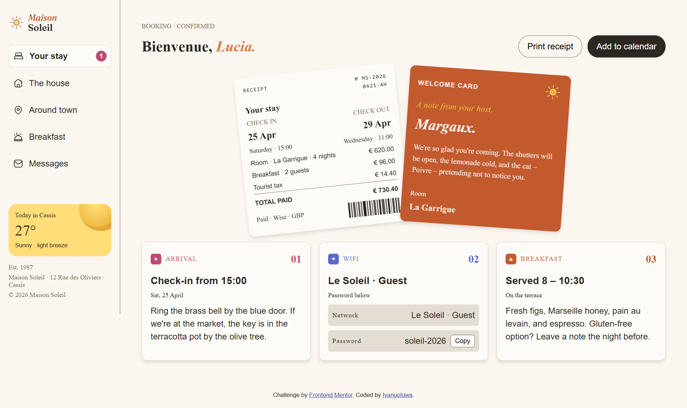

# Frontend Mentor - Hotel booking confirmation page solution

This is a solution to the [Hotel booking confirmation page challenge on Frontend Mentor](https://www.frontendmentor.io/challenges/hotel-booking-confirmation-page). Frontend Mentor challenges help you improve your coding skills by building realistic projects.

## Table of contents

- [Overview](#overview)
  - [The challenge](#the-challenge)
  - [Screenshot](#screenshot)
  - [Links](#links)
- [My process](#my-process)
  - [Built with](#built-with)
  - [What I learned](#what-i-learned)
  - [Continued development](#continued-development)
  - [AI Collaboration](#ai-collaboration)
- [Author](#author)

## Overview

### The challenge

Users should be able to:

- View the optimal layout for the interface depending on their device's screen size
- See hover and focus states for all interactive elements on the page
- Open and close the navigation menu on smaller screens
- Copy the Wi-Fi password to their clipboard using the copy button

### Screenshot



### Links

- Solution URL: [https://github.com/Iyanu22/hotel_booking_confirmation]
- Live Site URL: [https://iyanu22.github.io/hotel_booking_confirmation/]

## My process

### Built with

- Semantic HTML5 markup
- SCSS (variables, nesting, `@media` queries) compiled to CSS
- Flexbox for component-level layout
- CSS Grid for the desktop sidebar/main-content shell
- Mobile-first workflow
- Vanilla JavaScript — menu open/close state, keyboard support, and the Clipboard API for the Wi-Fi password copy button

### What I learned

I started by building this for desktop only, then went back to make it responsive — and that order caused most of the real bugs, so it's the main thing I'm taking away.

**Nested SCSS selectors compile to descendant selectors by default.** I had markup like `<aside class="sidebar" id="sidebar">`, where `sidebar` is a class on the element itself — but my SCSS nested `.sidebar` *inside* an `aside { }` block, which compiles to `.container aside .sidebar`. That selector requires `.sidebar` to be a *child* of `aside`, not the same element, so it silently matched nothing. The fixed positioning, slide-in transform, and `.is-open` toggle never applied, and there was no error anywhere — the styles just didn't exist. Retrofitting mobile behaviour onto desktop-first SCSS made this easy to miss, because the base (desktop) rules still rendered fine and hid the problem:

```scss
// Before — never matches anything, because .sidebar IS the <aside>, not a descendant of it
aside {
  .sidebar {
    position: fixed;
    transform: translateX(-100%);
  }
}

// After — matches the element directly
aside.sidebar {
  position: fixed;
  transform: translateX(-100%);
}
```

**The `&` symbol matters more than I realized.** `&` stands in for the parent selector with no space, which is required for modifier classes, pseudo-classes, and JS-toggled state classes:

```scss
.sidebar {
  &.is-open { transform: translateX(0); } // compiles to .sidebar.is-open — same element
}
```

Without `&`, that would compile to `.sidebar .is-open` — a descendant with a different class — which is the exact same category of bug as the one above.

**Rebuilding mobile-first instead of retrofitting fixed the root cause, not just the symptom.** Writing base styles for the smallest screen first and adding complexity at `min-width: 48rem` meant every rule had an obvious, single place it belonged, so there was no more guessing about how deep to nest something.

**Naming conventions prevent this class of bug.** Switching to BEM-style names (`.receipt__title`, `.info-card--wifi`) meant every class name encodes its own place in the hierarchy, so it's much harder to accidentally nest something one level too deep without noticing.

**Accessibility is cheap to build in, expensive to retrofit.** Adding `aria-expanded`, `aria-hidden`, `:focus-visible` outlines, an `Escape`-to-close handler, and focus management (moving focus into the menu on open, back to the trigger on close) took very little extra code once the component structure was already right — but would have meant re-touching every interactive element if I'd added it after the fact.

### Continued development

- Test the responsive breakpoints on real devices, not just by resizing a desktop browser window — the in-between widths are where layout bugs like the one above tend to hide.
- Add a `prefers-reduced-motion` check for anyone with that OS setting on, so the slide-in menu animation doesn't play for them.
- Try rebuilding this same challenge in React/Next.js — my usual stack — to compare how much of the accessibility work (focus trapping, `aria-*` sync) a component model handles for free versus by hand.
- Get more disciplined about compiling and opening the page after every meaningful SCSS change, rather than at the end of a session — that's what let the sidebar bug sit unnoticed for a while.

### AI Collaboration

I used Claude (Anthropic) throughout this build, in a few distinct ways:

- **Debugging**: I pasted my existing HTML/SCSS/JS and asked what was wrong. Claude traced the mobile menu failure back to the SCSS nesting issue described above, rather than just patching the symptom, and explained *why* the selector didn't match instead of only handing me a fix.

What worked well: getting a direct explanation of *why* something broke, not just a corrected file — that's what let me apply the same fix pattern (checking whether a nested selector's DOM assumption actually matches the markup) on my own afterward.

What I'd do differently: I gave Claude the finished mobile/desktop mockups partway through rather than at the start, which meant an earlier debugging pass was working from an incomplete picture of the target design. 

## Author

- Frontend Mentor - [@Iyanuoluwa](https://www.frontendmentor.io/profile/Iyanuoluwa) *(update with your actual username)*


## Using AI coding assistants

We've included two files to help you if you're using AI coding assistants (like Claude, GitHub Copilot, Cursor, etc.) while working on this challenge:

- `AGENTS.md` - Contains detailed instructions for AI assistants on how to help you with this challenge. It's tailored to this challenge's difficulty level, so the AI will provide guidance appropriate to your learning stage—offering more support for beginner challenges and encouraging more independence on advanced ones.
- `CLAUDE.md` - A pointer file that directs Claude-based tools to the AGENTS.md instructions.

**How to use them:** You don't need to do anything! These files are automatically detected by most AI coding tools. The AI will read them and adjust its behavior to be a better learning partner—guiding you toward solutions rather than just giving you the answers.

**Note:** These files are designed to help you *learn*, not to do the work for you. The AI is instructed to ask questions, give hints, and explain concepts rather than writing complete solutions.

## Building your project

Feel free to use any workflow that you feel comfortable with. Below is a suggested process, but do not feel like you need to follow these steps:

1. Initialize your project as a public repository on [GitHub](https://github.com/). Creating a repo will make it easier to share your code with the community if you need help. If you're not sure how to do this, [have a read-through of this Try Git resource](https://try.github.io/).
2. Configure your repository to publish your code to a web address. This will also be useful if you need some help during a challenge as you can share the URL for your project with your repo URL. There are a number of ways to do this, and we provide some recommendations below.
3. Look through the designs to start planning out how you'll tackle the project. This step is crucial to help you think ahead for CSS classes to create reusable styles.
4. Before adding any styles, structure your content with HTML. Writing your HTML first can help focus your attention on creating well-structured content.
5. Write out the base styles for your project, including general content styles, such as `font-family` and `font-size`.
6. Start adding styles to the top of the page and work down. Only move on to the next section once you're happy you've completed the area you're working on.

### Want some support on the challenge?

[Join our community](https://www.frontendmentor.io/community) and ask questions in the **#help** channel.

## Deploying your project

As mentioned above, there are many ways to host your project for free. Our recommended hosts are:

- [GitHub Pages](https://pages.github.com/)
- [Vercel](https://vercel.com/)
- [Netlify](https://www.netlify.com/)

You can host your site using one of these solutions or any of our other trusted providers. [Read more about our recommended and trusted hosts](https://www.frontendmentor.io/guides/hosting-your-solution).

## Submitting your solution

Submit your solution on the platform for the rest of the community to see. Follow our ["Complete guide to submitting solutions"](https://www.frontendmentor.io/guides/how-to-submit-solutions) for tips on how to do this.

Remember, if you're looking for feedback on your solution, be sure to ask questions when submitting it. The more specific and detailed you are with your questions, the higher the chance you'll get valuable feedback from the community.

**We strongly recommend overwriting this `README.md` with a custom one.** We've provided a template inside the [`README-template.md`](./README-template.md) file in this starter code. The template provides a guide for what to add. A custom `README` will help you explain your project and reflect on your learnings.

## Sharing your solution

There are multiple places you can share your solution:

1. Submit it on the platform and share your solution page in the **#finished-projects** channel of our [community](https://www.frontendmentor.io/community)
2. Share on [X (formerly Twitter)](https://x.com/frontendmentor) and mention **@frontendmentor**, including the repo and live URLs in your post. We'd love to take a look at what you've built and help share it around.
3. Share your solution on [LinkedIn](https://www.linkedin.com/company/frontend-mentor/).
4. Blog about your experience building your project. Writing about your workflow, technical choices, and talking through your code is a brilliant way to reinforce what you've learned. Great platforms to write on are [dev.to](https://dev.to/), [Hashnode](https://hashnode.com/), and [CodeNewbie](https://community.codenewbie.org/).

## Got feedback for us?

We love receiving feedback! We're always looking to improve our challenges and our platform. So if you have anything you'd like to mention, please email hi[at]frontendmentor[dot]io.

**This challenge is completely free. Please share it with anyone who will find it useful for practice.**

**Have fun building!** 🚀
